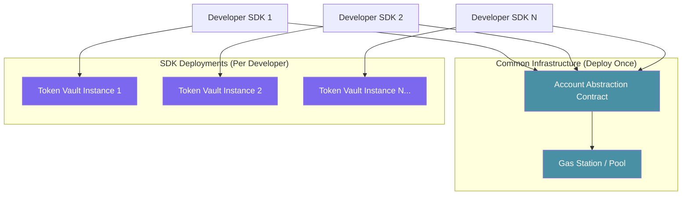

# Tychee Contracts Deployment Guide

> **Comprehensive guide for deploying Tychee smart contracts on Stellar Soroban**

## 📋 Table of Contents

- [Overview](#overview)
- [Prerequisites](#prerequisites)
- [Infrastructure Architecture](#infrastructure-architecture)
- [Phase 1: Common Infrastructure Deployment](#phase-1-common-infrastructure-deployment)
- [Phase 2: SDK-Driven Token Vault Deployment](#phase-2-sdk-driven-token-vault-deployment)
- [Environment Configuration](#environment-configuration)
- [Verification & Testing](#verification--testing)
- [Mainnet Deployment](#mainnet-deployment)
- [Troubleshooting](#troubleshooting)

---

## Overview

Tychee uses a **two-tier deployment model**:

| Contract | Deployment Model | Purpose |
|----------|------------------|---------|
| **Account Abstraction** | Shared Infrastructure (deploy once) | Gas sponsorship, session keys, meta-transactions |
| **Token Vault** | Per-Implementation (SDK deploys) | Card tokenization, encrypted storage |



---

## Prerequisites

### Development Tools

```bash
# 1. Install Rust (1.71+)
curl --proto '=https' --tlsv1.2 -sSf https://sh.rustup.rs | sh
rustup default stable
rustup target add wasm32-unknown-unknown

# 2. Install Stellar CLI
brew install stellar-cli
# Or via cargo:
cargo install stellar-cli --locked

# 3. Verify installations
stellar --version
rustc --version
```

### Account Setup

```bash
# Generate deployer keypair (SAVE THE SECRET KEY SECURELY!)
stellar keys generate deployer --network testnet

# View public key
stellar keys address deployer

# Fund account on testnet
stellar account fund deployer --network testnet
```

---

## Infrastructure Architecture

### Account Abstraction Contract

The Account Abstraction (AA) contract is **shared infrastructure** deployed once by Tychee Labs. It provides:

- **Gas Sponsorship**: Covers transaction fees for users
- **Session Keys**: Temporary keys for gasless operations
- **Meta-Transactions**: Execute transactions on behalf of users
- **Multi-Sig Support**: Enhanced security for high-value operations

| Function | Description |
|----------|-------------|
| `initialize(owner, initial_gas_pool)` | Setup contract with owner and gas funding |
| `set_mode(user, mode)` | Configure AA mode (Standard/Sponsored/SessionKey/MultiSig) |
| `set_sponsor(user, sponsor)` | Assign gas sponsor for a user |
| `add_session_key(user, key, duration, permissions)` | Add temporary session key |
| `execute_metatx(user, target, function, args)` | Execute sponsored transaction |
| `fund_gas_pool(amount)` | Top up gas pool (owner only) |

### Token Vault Contract

The Token Vault is deployed **per SDK implementation**. Each developer using the Tychee SDK will have their own Token Vault instance:

| Function | Description |
|----------|-------------|
| `initialize(owner)` | Setup contract with owner |
| `store_token(user, encrypted_payload, ...)` | Store encrypted card token |
| `retrieve_token(user)` | Retrieve encrypted token |
| `revoke_token(user)` | Revoke token access |
| `pause() / unpause()` | Emergency controls |

---

## Phase 1: Common Infrastructure Deployment

> **Important**: This phase is executed **once** by Tychee Labs infrastructure team.

### Step 1: Build Contracts

```bash
cd soroban

# Build all contracts
cargo build --target wasm32-unknown-unknown --release

# Verify WASM artifacts
ls -la target/wasm32-unknown-unknown/release/*.wasm
```

Expected output:
```
account_abstraction.wasm
token_vault.wasm
```

### Step 2: Deploy Account Abstraction Contract

```bash
# Deploy to testnet
stellar contract deploy \
  --wasm target/wasm32-unknown-unknown/release/account_abstraction.wasm \
  --source deployer \
  --network testnet

# Save the returned contract ID
# Example: CDXXXXXXXXXXXXXXXXXXXXXXXXXXXXXXXXXXXXXXXXXXXXXXXXXXXXXXXX
```

### Step 3: Initialize Account Abstraction

```bash
# Get deployer address
DEPLOYER_ADDRESS=$(stellar keys address deployer)

# Initialize with owner and gas pool (1,000,000 stroops = 0.1 XLM)
stellar contract invoke \
  --id <ACCOUNT_ABSTRACTION_CONTRACT_ID> \
  --source deployer \
  --network testnet \
  -- \
  initialize \
  --owner $DEPLOYER_ADDRESS \
  --initial_gas_pool 1000000
```

### Step 4: Fund Gas Pool

```bash
# Add funds for gas sponsorship (10,000,000 stroops = 1 XLM)
stellar contract invoke \
  --id <ACCOUNT_ABSTRACTION_CONTRACT_ID> \
  --source deployer \
  --network testnet \
  -- \
  fund_gas_pool \
  --amount 10000000
```

### Step 5: Verify Deployment

```bash
# Check gas pool balance
stellar contract invoke \
  --id <ACCOUNT_ABSTRACTION_CONTRACT_ID> \
  --source deployer \
  --network testnet \
  -- \
  get_gas_pool
```

---

## Phase 2: SDK-Driven Token Vault Deployment

> **This phase is executed by developers** when they integrate the Tychee SDK into their applications.

### Manual Deployment (For Development)

#### Step 1: Deploy Token Vault

```bash
# Deploy token vault contract
stellar contract deploy \
  --wasm target/wasm32-unknown-unknown/release/token_vault.wasm \
  --source <DEVELOPER_SECRET_KEY> \
  --network testnet

# Save the returned contract ID
```

#### Step 2: Initialize Token Vault

```bash
stellar contract invoke \
  --id <TOKEN_VAULT_CONTRACT_ID> \
  --source <DEVELOPER_SECRET_KEY> \
  --network testnet \
  -- \
  initialize \
  --owner <DEVELOPER_PUBLIC_KEY>
```

### Programmatic Deployment via SDK

The Tychee SDK can deploy Token Vault contracts programmatically using Account Abstraction for gasless deployment:

```typescript
import { TycheeSDK } from '@tychee/sdk';
import * as StellarSdk from '@stellar/stellar-sdk';
import fs from 'fs';

class TycheeDeployer {
  private sdk: TycheeSDK;
  private server: StellarSdk.Server;

  constructor(config: {
    horizonUrl: string;
    sorobanRpcUrl: string;
    accountAbstractionAddress: string;
    network: 'testnet' | 'mainnet';
  }) {
    // Initialize with AA contract for gasless deployment
    this.sdk = new TycheeSDK({
      stellarNetwork: config.network,
      horizonUrl: config.horizonUrl,
      sorobanRpcUrl: config.sorobanRpcUrl,
      tokenVaultAddress: '', // Will be set after deployment
      accountAbstractionAddress: config.accountAbstractionAddress,
      useAccountAbstraction: true,
    });
    
    this.server = new StellarSdk.Server(config.horizonUrl);
  }

  /**
   * Deploy a new Token Vault contract using AA for gas sponsorship
   */
  async deployTokenVault(deployerSecret: string): Promise<string> {
    await this.sdk.initialize(deployerSecret);
    
    // Read WASM bytecode
    const wasmPath = './soroban/target/wasm32-unknown-unknown/release/token_vault.wasm';
    const wasmCode = fs.readFileSync(wasmPath);
    
    const keypair = StellarSdk.Keypair.fromSecret(deployerSecret);
    const account = await this.server.loadAccount(keypair.publicKey());
    
    // Step 1: Upload WASM
    const uploadTx = new StellarSdk.TransactionBuilder(account, {
      fee: StellarSdk.BASE_FEE,
      networkPassphrase: StellarSdk.Networks.TESTNET,
    })
      .addOperation(
        StellarSdk.Operation.invokeHostFunction({
          func: StellarSdk.xdr.HostFunction.hostFunctionTypeUploadContractWasm({
            wasm: wasmCode,
          }),
          auth: [],
        })
      )
      .setTimeout(300)
      .build();
    
    // Simulate and submit
    // ... (simplified for documentation)
    
    // Step 2: Create contract instance
    // ... (deploy logic)
    
    // Step 3: Initialize contract
    // ... (initialization logic)
    
    // Return the new contract ID
    return '<NEW_TOKEN_VAULT_CONTRACT_ID>';
  }

  /**
   * Configure AA mode for gasless token operations
   */
  async setupGaslessMode(userAddress: string): Promise<void> {
    await this.sdk.setAAMode('sponsored');
    console.log('Gasless mode enabled for:', userAddress);
  }
}

// Usage example
async function main() {
  const deployer = new TycheeDeployer({
    horizonUrl: 'https://horizon-testnet.stellar.org',
    sorobanRpcUrl: 'https://soroban-testnet.stellar.org',
    accountAbstractionAddress: 'CDXXXXXXXXXXXXXXXXXXXXXXXXXXXXXXXXXXXXXXXXXXXXXXXXXXXXXXXX',
    network: 'testnet',
  });

  // Deploy new Token Vault
  const contractId = await deployer.deployTokenVault('SXXXXX...');
  console.log('Token Vault deployed:', contractId);

  // Enable gasless mode
  await deployer.setupGaslessMode('GXXXXX...');
}
```

### Deployment Script

Create a deployment script for automated Token Vault deployment:

```bash
#!/bin/bash
# scripts/deploy-token-vault.sh

set -e

# Configuration
NETWORK="${NETWORK:-testnet}"
AA_CONTRACT_ID="${AA_CONTRACT_ID:-}"

# Check AA contract is set
if [ -z "$AA_CONTRACT_ID" ]; then
    echo "Error: AA_CONTRACT_ID environment variable required"
    exit 1
fi

# Generate new deployer key if not provided
if [ -z "$DEPLOYER_SECRET" ]; then
    stellar keys generate token_vault_deployer --network $NETWORK
    DEPLOYER_ADDRESS=$(stellar keys address token_vault_deployer)
    stellar account fund token_vault_deployer --network $NETWORK
    echo "Generated new deployer: $DEPLOYER_ADDRESS"
else
    echo "Using provided deployer key"
fi

# Build contracts
echo "Building Token Vault contract..."
cd soroban
cargo build --target wasm32-unknown-unknown --release

# Deploy
echo "Deploying Token Vault..."
TOKEN_VAULT_ID=$(stellar contract deploy \
    --wasm target/wasm32-unknown-unknown/release/token_vault.wasm \
    --source token_vault_deployer \
    --network $NETWORK)

echo "Token Vault deployed: $TOKEN_VAULT_ID"

# Initialize
echo "Initializing Token Vault..."
stellar contract invoke \
    --id $TOKEN_VAULT_ID \
    --source token_vault_deployer \
    --network $NETWORK \
    -- \
    initialize \
    --owner $(stellar keys address token_vault_deployer)

# Register with AA (optional - for gasless operations)
echo "Registering with Account Abstraction..."
stellar contract invoke \
    --id $AA_CONTRACT_ID \
    --source token_vault_deployer \
    --network $NETWORK \
    -- \
    set_mode \
    --user $(stellar keys address token_vault_deployer) \
    --mode Sponsored

echo "✅ Deployment complete!"
echo ""
echo "Configuration for .env.local:"
echo "SOROBAN_CONTRACT_ADDRESS=$TOKEN_VAULT_ID"
echo "ACCOUNT_ABSTRACTION_ADDRESS=$AA_CONTRACT_ID"
```

---

## Environment Configuration

### Update `.env.local`

After deployment, update your environment configuration:

```bash
# Stellar Configuration
STELLAR_NETWORK=testnet
STELLAR_HORIZON_URL=https://horizon-testnet.stellar.org
SOROBAN_RPC_URL=https://soroban-testnet.stellar.org

# Contract Addresses
SOROBAN_CONTRACT_ADDRESS=<YOUR_TOKEN_VAULT_CONTRACT_ID>
ACCOUNT_ABSTRACTION_ADDRESS=<SHARED_AA_CONTRACT_ID>

# Enable Account Abstraction
USE_ACCOUNT_ABSTRACTION=true
```

### SDK Configuration

```typescript
import { TycheeSDK } from '@tychee/sdk';

const sdk = new TycheeSDK({
  stellarNetwork: 'testnet',
  horizonUrl: process.env.STELLAR_HORIZON_URL!,
  sorobanRpcUrl: process.env.SOROBAN_RPC_URL!,
  tokenVaultAddress: process.env.SOROBAN_CONTRACT_ADDRESS!,
  accountAbstractionAddress: process.env.ACCOUNT_ABSTRACTION_ADDRESS,
  useAccountAbstraction: process.env.USE_ACCOUNT_ABSTRACTION === 'true',
});
```

---

## Verification & Testing

### Contract Tests

```bash
# Run Soroban contract tests
cd soroban/contracts/token_vault
cargo test

# Run all contract tests
cd soroban
cargo test --workspace
```

### SDK Integration Tests

```bash
cd sdk
npm test
```

### Manual Verification Checklist

- [ ] Account Abstraction contract deployed and initialized
- [ ] Gas pool funded with sufficient balance
- [ ] Token Vault contract deployed and initialized
- [ ] SDK connects to both contracts successfully
- [ ] Store token operation works
- [ ] Retrieve token operation works
- [ ] Revoke token operation works
- [ ] Gasless transactions work (if AA enabled)

### Verify Contract State

```bash
# Check AA gas pool
stellar contract invoke \
  --id $AA_CONTRACT_ID \
  --source deployer \
  --network testnet \
  -- \
  get_gas_pool

# Check Token Vault count
stellar contract invoke \
  --id $TOKEN_VAULT_ID \
  --source deployer \
  --network testnet \
  -- \
  get_token_count

# Check if paused
stellar contract invoke \
  --id $TOKEN_VAULT_ID \
  --source deployer \
  --network testnet \
  -- \
  is_paused
```

---

## Mainnet Deployment

> ⚠️ **Warning**: Mainnet deployment involves real funds. Proceed with caution.

### Pre-Deployment Checklist

- [ ] All tests passing on testnet
- [ ] Security audit completed
- [ ] Backup of all keys and contract IDs
- [ ] Sufficient XLM for deployment and gas pool
- [ ] Team approval for production deployment

### Mainnet Deployment Steps

```bash
# 1. Generate production keypair (SECURE STORAGE!)
stellar keys generate production_deployer --network mainnet

# 2. Fund with XLM from exchange or existing wallet
# (Manual step - ensure sufficient balance)

# 3. Deploy Account Abstraction (Infrastructure team only)
stellar contract deploy \
  --wasm target/wasm32-unknown-unknown/release/account_abstraction.wasm \
  --source production_deployer \
  --network mainnet

# 4. Initialize with production gas pool
stellar contract invoke \
  --id <AA_CONTRACT_ID> \
  --source production_deployer \
  --network mainnet \
  -- \
  initialize \
  --owner <OWNER_ADDRESS> \
  --initial_gas_pool 100000000  # 10 XLM

# 5. Deploy Token Vault instances as needed
# (Follow SDK deployment process)
```

### Update Production Environment

```bash
# .env.production
STELLAR_NETWORK=mainnet
STELLAR_HORIZON_URL=https://horizon.stellar.org
SOROBAN_RPC_URL=https://soroban.stellar.org
SOROBAN_CONTRACT_ADDRESS=<MAINNET_TOKEN_VAULT_ID>
ACCOUNT_ABSTRACTION_ADDRESS=<MAINNET_AA_CONTRACT_ID>
```

---

## Troubleshooting

### Common Issues

| Issue | Cause | Solution |
|-------|-------|----------|
| "Already initialized" | Contract already set up | Use existing contract or deploy new instance |
| "Insufficient gas pool" | Gas pool depleted | Call `fund_gas_pool` with more funds |
| "No sponsor set" | Missing sponsor for gasless tx | Call `set_sponsor` first |
| "Token already exists" | User has existing token | Revoke first or use different user |
| WASM too large | Contract size exceeds limit | Optimize with `opt-level = "z"` |

### Debug Commands

```bash
# Check account balance
stellar account info <PUBLIC_KEY> --network testnet

# View contract events
stellar contract events \
  --id <CONTRACT_ID> \
  --network testnet \
  --limit 10

# Simulate transaction (dry run)
stellar contract invoke \
  --id <CONTRACT_ID> \
  --source deployer \
  --network testnet \
  --simulate-only \
  -- \
  <function_name> \
  --<arg1> <value1>
```

### Get Help

- 📖 [Stellar Developer Docs](https://developers.stellar.org/)
- 📖 [Soroban Documentation](https://soroban.stellar.org/)
- 💬 [Stellar Discord](https://discord.gg/stellar)
- 📧 Contact: ops@tychee.store

---

## Quick Reference

### Contract IDs (Testnet)

| Contract | ID | Status |
|----------|-----|--------|
| Account Abstraction | `<TO_BE_FILLED>` | Shared Infrastructure |
| Token Vault (Demo) | `<TO_BE_FILLED>` | Example Instance |

### Key Commands

```bash
# Build all
cargo build --target wasm32-unknown-unknown --release

# Deploy
stellar contract deploy --wasm <FILE> --source <KEY> --network testnet

# Invoke
stellar contract invoke --id <ID> --source <KEY> --network testnet -- <FUNCTION> <ARGS>

# Check events
stellar contract events --id <ID> --network testnet
```

---

*Last updated: January 2026*
